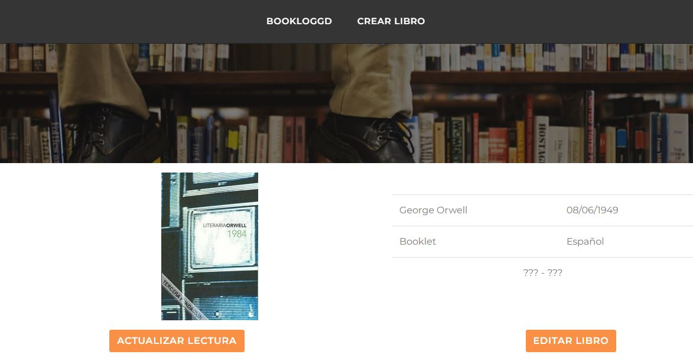
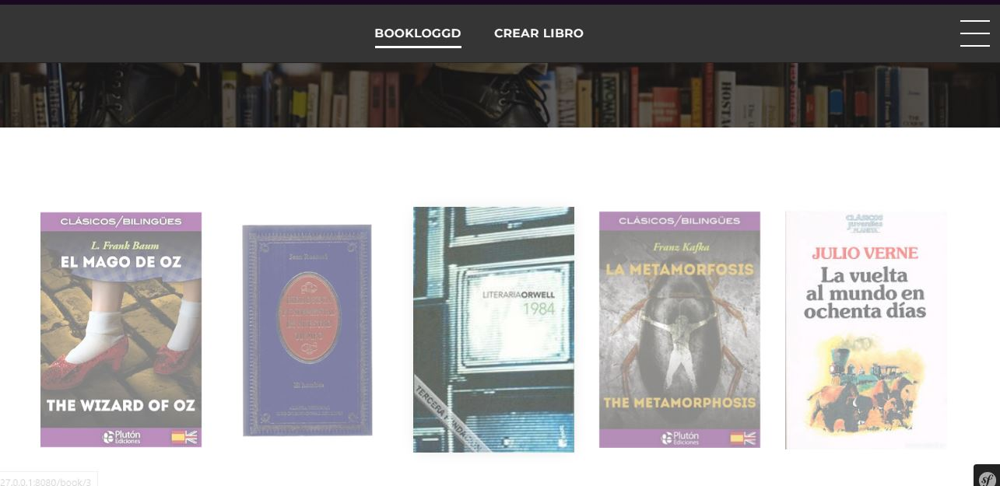

# Bookloggd

¿Buscando una web que administre un registro de los libros que lees? No busquees más, ese es el objetivo de Bookloggd. 

Crea un registro de tus lecturas, estén terminadas, abandonadas o en interés. 

¡Además! como el programa corre en local, toda la información es completamente privada y personalizable. Añade los libros que quieras, ¡sin importar de su idioma o editorial! 

### Instalación

Primero de todo, instalemos la aplicación.

####
		git clone https://github.com/AlejandroMirallesRuiz/bookloggd.git
		cd bookloggd/Library

A continuación descargaremos las dependencias necesarias. Primero ve al fichero .env y asigne el valor "prod" a la variable "APP_ENV".

#### 
		composer install

En este proyecto se utiliza un fichero sqlite como la base de datos. Si quieres usar otra, configura el endpoint en .env. Más tarde, cree el esquema de la base de datos con:

####
		php bin/console doctrine:database:create
		php bin/console doctrine:migrations:migrate

Finalmente corra la aplicación. Ve a la carpeta ./public y ejecute el siguiente comando:

####		
	php -S localhost:8080

¡Et voilé! Si abres un navegador y escribes localhost:8080 o 127.0.0.1:8080 en la barra de búsqueda, podrás usar tu biblioteca personalizada. 

